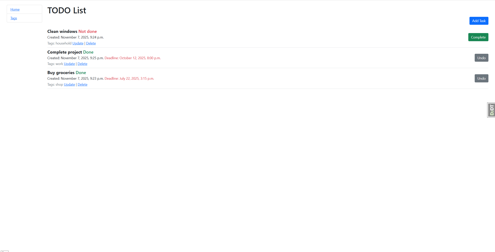

# Todo List
> A simple Django web application for managing tasks and tags with deadlines and completion tracking.

This project allows users to organize their daily tasks effectively -
you can add tasks with deadlines, mark them as done or undone, manage tags, and keep everything clean and organized with pagination and Bootstrap design.


## Technologies Used

* Python 3
* Django 5
* Bootstrap 5
* Crispy Forms
* SQLite

## Main page


## Installation

A quick guide to set up and run the project locally.

1.Clone the repository:

```shell
git clone https://github.com/irina957/Todo-list.git
cd todolist
```
2.Create a virtual environment:

```shell
 python -m venv venv
venv\Scripts\activate (Windows)
source venv/bin/activate (macOS)
```
3.Install dependencies:

```shell
pip install -r requirements.txt
```
4.Create and apply migrations:

```shell
python manage.py makemigrations
python manage.py migrate
```

5.Run the development server:

```shell
python manage.py runserver
```